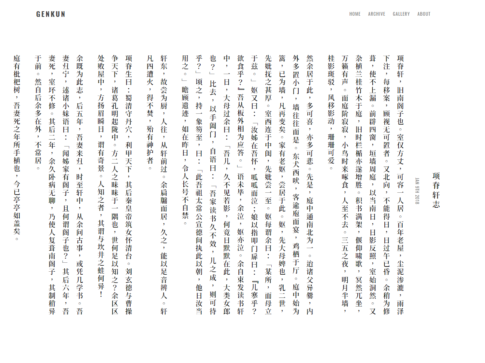

# HIRUKO

A POWERFUL, SIMPLE and CLEAN theme for [Hugo](https://gohugo.io/).

- [Preview](https://blog.genkun.me)

Inspired by [Prince](https://github.com/yiliashaw/hexo-theme-prince), [Free Mind](http://freemind.pluskid.org/) and [Fate/Typo](https://fatetypo.xyz)

## Features

- **MathJax**

    Usage: Add `mathjax: true` to the posts which need MathJax rendering.

- **Disqus Comments**

    Usage: Add your Disqus id to `config.toml`.

    ```
    [params]
        disqus = "genkun"
    ```

- **Vertical Layout**

    Preview: 
    
    

    Usage: Add `vertical: true` to the posts.

- **Web-Fonts**

    Powered by [Font-Spider](https://github.com/aui/font-spider).

## Installation

- **Install**

    ``` bash
    $ git submodule add https://github.com/GenkunAbe/hugo-theme-hiruko.git themes/hiruko
    ```

- **Enable**

    Add `theme = "hiruko"` in `config.toml`.

- **Update**

    ``` bash
    git submodule update --recursive --remote
    ```